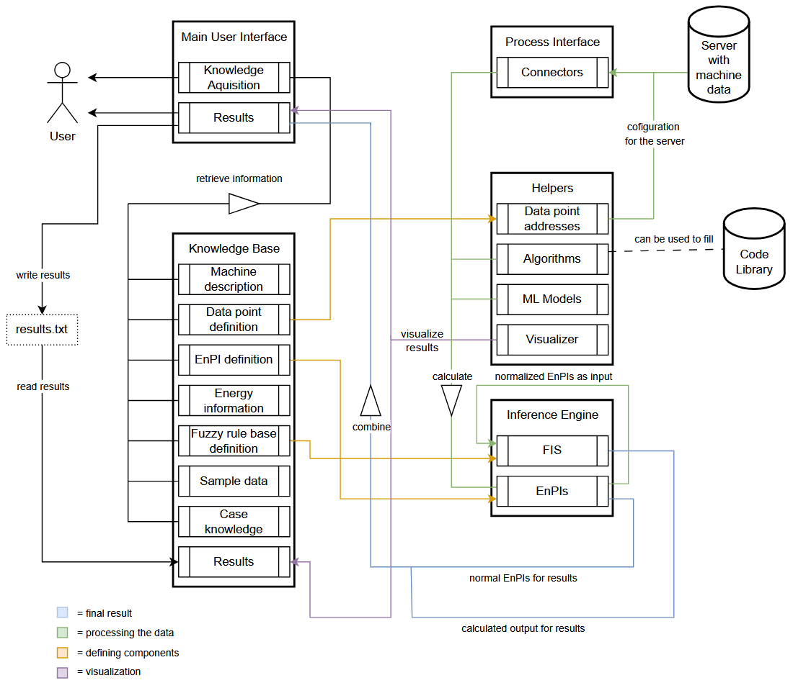

# Expert System Shell for Energy Efficiency
This is the README file for the expert system shell. It contains all the information
necessary to understand and use the project. 

Make sure to keep this file up to date so that anyone who wants to use the project can 
easily understand how to use it and what it does.
Please follow the template provided in this file when adding new content to it to 
ensure that the README file continues to be easy to read and understand.

### What is an Expert system?
In the industry sector, an _Expert System_ is a specialized software tool 
that analyzes data, applies predefined rules or ML-Models, and provides 
recommendations for optimizing energy use. Expert Systems help monitor performance, 
detect inefficiencies, and automate decision-making to improve energy savings.

The __Expert System Shell for Energy Efficiency__ enables users with minimal programming expertise
to create their own expert systems. It provides them with a predefined structure and easy-to-understand
examples to guide them through the implementation process.
## Table of Contents
  - [Detailed Description](#detailed-description)
    - [Interaction Overview](#interaction-overview)
    - [Knowledge Base](#knowledge-base)
    - [Process Interface](#process-interface)
    - [Helpers](#helpers)
       - [Code Library](#code-library)
    - [Inference Engine](#inference-engine)
    - [Main User Interface](#main-user-interface)
  - [Installation Guide](#installation-guide)
    - [General Version](#general-version)
    - [PyCharm Version](#pycharm-version)
  - [User Guide](#user-guide)
  - [License](#license)
  - [Contributors](#contributors)
## Detailed Description
Our Expert System Shell is divided into several components that work together to create an expert system after 
being filled. 
<br>In the following sections, we will explain each component to help you understand how they work together.
### Interaction Overview 

### Knowledge Base
The Knowledge Base acts as convenient display of information relevant to the machine and its energy consumption.
Not all of these components are relevant for the results of the expert system, and the ones that are have links to the components where they are actually implemented.
The knowledge base consists of 8 components:
1. Machine description: contains an image that visualizes the machine and how it works, may have a link to website for further clarification.
2. Data Point Definition: defines the data points that are relevant to the machine.
3. EnPI definition: defines the Energy Performance Indicators (EnPIs), that are used for the Expert System.
4. Energy information: displays other kinds of information, concerning energy consumption of the machine in unstructured text.
5. Fuzzy rule base definition: defines fuzzy rules that are used to evaluate the machine.
6. Sample data: displays the sample data that demonstrates the required structure of .csv files for successfully utilizing the expert system.
7. Case knowledge: displays case-specific knowledge for the expert system located in case-knowledge.csv.
8. Result: displays results of the expert system stored in results.txt.
### Process Interface
The Process Interface serves as the bridge between the Main User Interface and external machine data sources.It collects data through connectors, which is then used by the Knowledge Base and Inference Engine for further processing and visualization

The Process Interface includes the following component:
1. **Connectors**:
The Process Interface includes connectors that facilitate communication between the expert system and external data sources, such as a server with machine data.
These connectors enable the retrieval of real-time or stored data for further processing.

**Data Flow**:
The Process Interface collects and organizes machine-related data, which is then passed to the Helpers module.
The Helpers module consists of data points, algorithms, machine learning models, and visualizers that assist in analyzing and interpreting the information.
Once processed, the data is sent to the Inference Engine, which applies Fuzzy Inference Systems (FIS) and Energy Performance Indicators (EnPIs) to generate meaningful insights.

For more details, check the [process_interface.ipynb](./ES-Shell/Process_Interface/process_interface.ipynb) file.

### Helpers
The Helpers component is a key part of the ESS4EE system, 
supporting the analysis of input data through the integration of 
Machine Learning models, algorithms, and visualization functions. 
It also manages the data points used to connect the system to the machines 
for data retrieval. This component ensures efficient data processing, 
advanced analytics, and effective communication of results.

The Helpers component consists of four subcomponents, each serving a specific function:
1. **Data Point Addresses**: This subcomponent manages the configuration for the 
OPC UA server, including the server URL and node IDs. 
These addresses are essential for the connectors in the Process Interface 
to establish connections with machines and retrieve data.
2. **Machine Learning Models**: The ML models subcomponent integrates machine 
learning capabilities into the system, enabling advanced tasks such as 
prediction, classification, and anomaly detection. It allows users to 
incorporate pre-trained or custom models, enhancing the system's intelligence 
and analytic capabilities.
3. **Algorithms**: This subcomponent handles the logic and processes necessary 
for data analysis, decision-making, and preprocessing. 
It works in conjunction with the data points, machine learning models, 
and visualization tools, ensuring that the system operates efficiently 
and effectively.
4. **Visualization Functions**: The visualization functions create charts, graphs, 
and other visualizations to present data and results clearly. 
These visuals help users analyze trends, monitor system performance, 
and interpret the outcomes of computations, improving the overall understanding 
and usability of the system.

For more details, check the [helpers.ipynb](./ES-Shell/Helpers/helpers.ipynb) file.
#### Code Library
Additionally, the Helpers component includes a Code Library,
which contains a collection of preexisting code examples for the subcomponents. 
These code snippets can be easily integrated into the shell, 
offering ready-made solutions for tasks related to the Expert System. 
Users can also add their own custom code examples to the library, 
enabling the system to expand with personalized functions for future use.

For  more details, check the [code_library.ipynb](./ES-Shell/Helpers/Code_Library/code_library.ipynb) file.

### Inference Engine
The Inference Engine is responsible for applying rules and algorithms to the data provided by the Knowledge Base and Process Interface. It uses Fuzzy Inference Systems (FIS) and Energy Performance Indicators (EnPIs) to analyze the data, simulate decision-making processes, and generate recommendations for energy optimization. The engine processes the inputs and derives insights that contribute to the expert system's conclusions.

For more details, check the [inference_engine.ipynb](./ES-Shell/Inference_Engine/inference_engine.ipynb) file.
### Main User Interface
The Main User Interface (UI) is the front-end component of the expert system that allows users to interact with the system easily. It provides a clear and intuitive interface for inputting data, viewing results, and visualizing energy optimization recommendations. The UI offers both online and offline modes, allowing users to work with real-time or stored data. It also includes visualization tools to display the expert system’s output effectively.

For more details, check the [main_user_interface.ipynb](./ES-Shell/Main_User_Interface/main_user_interface.ipynb) file.
## Installation Guide
This installation guide will help you clone the project to your machine and open it in JupyterLab
to start working on it. To clone and edit the repository, you need to have a GitHub account,
so please create one beforehand.

Make sure you have `git` and Python 3.12 installed on your machine. 
<br>To check this, open a terminal and type the following commands:
``` bash
    git --version
    python --version
```
In case you don't have them installed, you can use the following links to download them:
- [Git](https://git-scm.com/downloads)
- [Python](https://www.python.org/downloads/)

You will need `pip` to install the required packages. It should be installed automatically with Python.
<br> To check if `pip` is installed on your machine, type the following command in the terminal:
``` bash
    python -m pip --version
```

This installation guide will include a general version which requires no IDE and a version for PyCharm.

### General Version
Open a terminal and navigate to the directory where you want to clone the repository.
<br>Then type the following commands:
``` bash
    git clone https://github.com/reshtyy/BP-ESS4EE.git
    cd BP-ESS4EE
```
Now, to create and activate a virtual environment:
``` bash
    python -m venv venv
    venv/Scripts/activate
```
With the virtual environment activated, you can now install the required packages:
``` bash
    pip install -r requirements.txt
```
Wait for the required packages to be installed. Once the installation is complete,
you can start working on the project.
<br> To open the project in JupyterLab, type the following command:
``` bash
    jupyter lab
```
This will open JupyterLab in your default browser. You can now start working on the project.

### PyCharm Version
Before cloning the repository, make sure your GitHub account is linked to PyCharm. To do this, go to:
`File -> Settings -> Version Control -> GitHub` 
Click on the `+` sign and enter your GitHub credentials. Once you have linked your GitHub account to PyCharm,
you can clone the repository. To do this, go to:
`File -> Project from Version Control`, enter the following URL: 
`https://github.com/reshtyy/BP-ESS4EE.git` and choose the directory where you want the project to be cloned.

Once the project is cloned, open a terminal and create a virtual environment:
``` bash
    python -m venv venv
    venv/Scripts/activate
```
With the virtual environment activated, you can now install the required packages:
``` bash
    pip install -r requirements.txt
```
Wait for the required packages to be installed.
<br> Now you need to set up a python interpreter. To do this, go to: 
```
    File -> Settings -> Project: [Your Project Name] -> Python Interpreter
```
Click `Add Interpreter -> Add local Interpreter`, choose `Select existing` and 
add the path `<path-to-your-project>/venv/Scripts/python.exe`. Click `OK` to save the changes.

Now you are all set up to start working on the project.

If you prefer JupyterLab over PyCharm, open the terminal and type:
``` bash
    jupyter lab
```
This will open JupyterLab in your default browser.
## User Guide
This section will guide you through the process of creating an expert system using 
the Expert System Shell for Energy Efficiency.

After setting up the project as described in the [Installation Guide](#installation-guide), 
you should start by filling in the components of the _knowledge base_ jupyter notebook
file. You can find the file [here](./ES-Shell/Knowledge_Base/knowledge_base.ipynb).
<br>You will notice that the file is designed in a way that guides you through the process by providing
you with examples and explanations for each component, as well as links to the relevant files.

With the _knowledge base_ file completed, you already have implemented a big part of the expert system.
The next step is to fill in the remaining components of the _helpers_, namely the 
[algorithms.py](./ES-Shell/Helpers/algorithms.py) file. 
<br>You can directly edit the file by implementing your own algorithms or use one of the algorithms provided in
the _[code library](./ES-Shell/Helpers/Code_Library/code_library.ipynb)_. 

With that, you are ready to implement the final component of the expert system, the _main user interface_.
<br>You can find the file [here](./ES-Shell/Main_User_Interface/main_user_interface.ipynb).
<br>The _knowledge acquisition_ part of the component is already implemented, so you only need to 
complete the _results_ block and the visualization afterward.
<br>The _results_ block is where you will define how the expert system should act when asked to return a result. 
We distinguish between an _offline_ and an _online_ mode, which can be chosen by the user via a dropdown window.
<br>Of your interest are the following lines of code:
- __line 11:__ The path to the offline data which should point to the .csv file containing 
offline data you want to use. If your system does not have offline data, you can ignore this part.
- __lines 18-20:__ This part of the code calls the read_opcua_values function, which reads the data from the OPC UA server with the
server URL and node ID defined in the data_point_definition.py file located in the _helpers_ component.
- __lines 33-53:__ This part of the code is where the output of your expert system is calculated. The code is 
well-documented, and you should be able to understand what it does with the help of the provided comments.

The rest of the code block creates the dropdown window and makes sure that the output block always displays the 
correct results (e.g. results for offline data if chosen mode is _offline_). If you don't want to use the dropdown window,
feel free to remove all the code from the code block except lines 33-53 and either line 11, when using offline data, 
or lines 18-20, when using online data.
<br>You can use the last code block in the file to visualize the results of your expert system.

If you're done, you can run your _main_user_interface.ipynb_ file, and it should display the results of your expert system
and write them to the [results.txt](./ES-Shell/Knowledge_Base/results.txt) file.

You can also refer to the [TO-DO list](./ToDo_List.ipynb) to ensure you complete every step without missing anything.
<br>For additional information and more detailed instructions on individual components, please refer to the [Detailed Description](#detailed-description) 
section or the Jupyter Notebook files located in the directory of each respective component.
## License
The project uses the [MIT License](./LICENSE), so feel free to use it for your own projects.
## Contributors
- Cekim Yoldas ([GitHub](https://github.com/bleach63))
- Lukas Horn ([GitHub](https://github.com/reshtyy))
- Narges Ahmadi Asl ([GitHub](https://github.com/narg3s))
- Lasse Zimmer ([GitHub](https://github.com/joos-de-momper))
- Andre Wigandt ([GitHub](https://github.com/AndreWigandt))
- Borys Ioshchikhes ([GitHub](https://github.com/Borika95))


